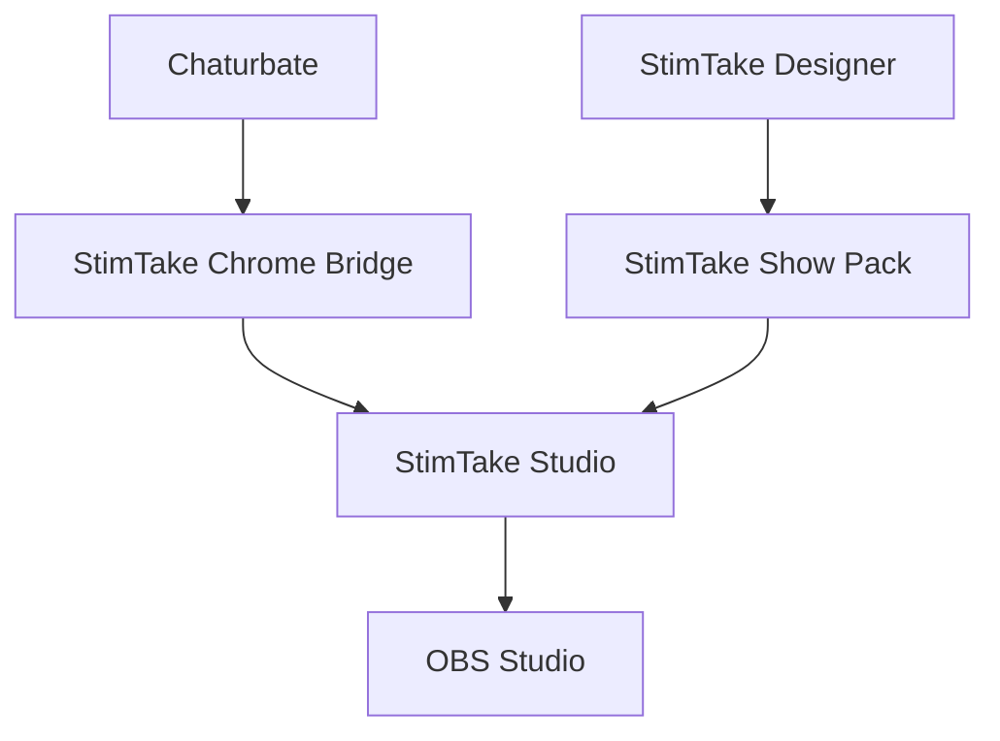

# StimTake Studio 6.0

> **A creator-first live-show automation system for Chaturbate and OBS, built around two purposeful applications: a simple model-facing Studio for running shows, and a separate Designer for building actions, overlays, themes, and reusable Show Packs.**

---

## Version 6 Working Build

**Version:** 6.0  
**Status:** Working local V6 model build  
**Architecture:** Two-App Product Family  
**Studio:** StimTake Studio 6.0  
**Designer:** StimTake Designer 1.0  
**Primary Goal:** Keep live operation simple for the model while development and content-authoring tools remain isolated in StimTake Designer.


### Simple V6 Architecture

```text
StimTake Studio 6.0
├── StimTake-Studio-6.0.exe
├── Connectors/
│   └── StimTakeChaturbateBridge/
│       └── Chrome-side Chaturbate tip bridge
├── Local backend
│   └── Port 8787
├── Show Pack runtime
│   └── 20-action overlay packs
└── OBS output
    └── Browser Source overlays

StimTake Designer 1.0
└── StimTake-Designer-1.0.exe
    └── Content-authoring / development workflow
```

Live event flow:

```text
Chaturbate in Google Chrome
        ↓
StimTakeChaturbateBridge
        ↓
StimTake Studio 6.0
        ↓
Action / supporter / Show Pack logic
        ↓
OBS Browser Source
        ↓
Visible on-stream action
```

### Verified working milestone — 2026-08-11

The current V6 milestone has a successful Windows build for both applications, with the Chaturbate bridge working as the browser connector:

```text
StimTake-Studio-6.0.exe
StimTake-Designer-1.0.exe
Connectors\StimTakeChaturbateBridge\
```

The working live stack is therefore:

```text
Google Chrome + StimTakeChaturbateBridge
StimTake Studio 6.0
OBS Studio
```

The bridge is required for Chaturbate tip events to reach Studio, and OBS is required for the visual overlay output.

The latest reported validation completed with **0 final failures** and covered the local runtime/security path, Studio and Designer launch, port `8787` lifecycle, `/api/studio-status`, the simplified overlay page, wrong-room rejection, duplicate-event protection, repeated legitimate tips, Top Tippers/VIP behavior, action range matching, ON/OFF behavior, overlap rejection, Show Pack import/action execution/auto-stop, and Chrome Bridge V3 parser/integration/syntax regressions.

Manual live acceptance performed after the packaged V6 validation also confirmed a real Chaturbate tip reaching the running Studio status endpoint and the OBS overlay operating during a live model session. The packaged `V6-FINAL-VALIDATION.txt` predates that owner acceptance and therefore correctly records the real live tip path as unproven **in that earlier validation run**.

V6 is a **working model**, not yet a final public release. Clean-machine installer/QA and optional WebView2 work remain separate future milestones.

```text
STIMTAKE 6.0

MODEL APP
StimTake Studio
    ↓
Run the show
Track tips
Trigger actions
Update overlays
Manage session/lifetime supporters

DEVELOPER APP
StimTake Designer
    ↓
Build actions
Build overlays
Build themes
Preview content
Export Show Pack ZIPs
```

Version 6 is not about adding more controls to one giant window.

It is about giving each application one clear purpose.

---

# The Two-App Product

## StimTake Studio — Model / User App

StimTake Studio is the application the model opens before going live.

Its job is to be simple, fast, reliable, and mostly automatic.

The model should not need to understand:

- raw JSON;
- localhost endpoints;
- browser DOM parsing;
- API internals;
- action-package file structure;
- HTML/CSS/JavaScript editing;
- overlay development;
- backend launch scripts.

The normal Studio experience should answer only a few questions:

```text
Am I connected?
Am I watching the correct model?
Is OBS connected?
What was the last tip?
How is the current session going?
Which show actions are active?
```

Target Studio workflow:

```text
Start StimTake Studio
        ↓
Saved model loads
        ↓
Backend starts automatically
        ↓
Chrome Bridge / locked model monitor watches room
        ↓
OBS connects
        ↓
Start session
        ↓
Real tip arrives
        ↓
StimTake validates + deduplicates
        ↓
Supporter totals update
        ↓
Matching action runs
        ↓
OBS overlay updates
```

---

## StimTake Designer — Developer / Creator App

StimTake Designer is a separate application for building the creative content used by Studio.

Its responsibilities are:

- action creation;
- overlay creation;
- HTML/CSS/JavaScript editing;
- sound selection;
- image and animation assets;
- action preview;
- theme design;
- layout design;
- validation;
- Show Pack assembly;
- ZIP export.

Target Designer workflow:

```text
Create Show Pack
        ↓
Add Action 01
Add Action 02
...
Add Action 20
        ↓
Add overlay HTML/CSS/JS
Add images/sounds/assets
        ↓
Preview
        ↓
Validate
        ↓
Build Show Pack ZIP
        ↓
Import into StimTake Studio
```

The Designer creates **what an action does**.

The model decides **how many tokens trigger it**.

---

# Show Pack Architecture

StimTake 6.0 introduces a clearer contract between Studio and Designer.

A Show Pack is portable content.

Example:

```text
Halloween-Show-Pack.zip
Christmas-Show-Pack.zip
Neon-Night-Pack.zip
Custom-Model-Pack.zip
```

A Show Pack may contain up to 20 actions.

Example structure:

```text
show-pack/
├── pack.json
├── theme/
│   ├── theme.json
│   └── assets/
│
└── actions/
    ├── action-01/
    │   ├── action.json
    │   ├── overlay.html
    │   └── assets/
    ├── action-02/
    ├── action-03/
    └── ...
        └── action-20/
```

The Show Pack contract is implemented as **schema v1** and is validated by Studio before activation.

The architectural rule is already decided:

```text
Designer defines:
    Action identity
    Overlay
    Assets
    Animation
    Sound
    Theme behavior

Studio defines:
    Token amount
    Enabled / disabled state
    Show-specific assignment
```

Example:

```text
Designer creates:
Ghost Animation

Model chooses:
25 tokens → Ghost Animation
```

This makes packs reusable across different models.

---

# Model-Facing Studio UI

The Version 6 Studio UI should be intentionally minimal.

Target dashboard:

```text
┌─────────────────────────────────────────────────────┐
│ STIMTAKE STUDIO                         ● READY    │
│ obsidian_stallion 🔒                               │
├─────────────────────────────────────────────────────┤
│ STATUS                                              │
│                                                     │
│ Model Monitor     ● WATCHING                       │
│ Chrome Bridge     ● CONNECTED                      │
│ Backend           ● RUNNING                        │
│ OBS               ● CONNECTED                      │
│                                                     │
├─────────────────────────────────────────────────────┤
│ LIVE SESSION                                        │
│                                                     │
│ Tips              12                               │
│ Tokens            245                              │
│ Last Tip          sunnyson3 • 25 tokens            │
│                                                     │
│ [ START NEW SESSION ]   [ END SESSION ]            │
│                                                     │
├─────────────────────────────────────────────────────┤
│ SHOW ACTIONS                                        │
│                                                     │
│   5 tokens    Black Cat                            │
│  10 tokens    Lightning                            │
│  25 tokens    Ghost                                │
│  50 tokens    Fire                                 │
│  ...                                               │
│                                                     │
│ [ EDIT TIP AMOUNTS ]                               │
│                                                     │
├─────────────────────────────────────────────────────┤
│ TOP TIPPERS                                         │
│                                                     │
│ 1. sunnyson3                         100            │
│ 2. bstudly                            60            │
│ 3. mister_fun                         40            │
│                                                     │
├─────────────────────────────────────────────────────┤
│ [ MY ROOM ] [ HISTORY ] [ SETTINGS ]               │
└─────────────────────────────────────────────────────┘
```

The model should not need a developer dashboard during a normal live show.

---


# Normal Model Workflow

The model-facing workflow is designed to stay simple: start Studio, confirm READY, start the session, and let StimTake handle tip tracking, supporter totals, show actions, overlays, and persistence automatically.

```mermaid
flowchart TD

    A[Open StimTake Studio 6.0]

    A --> B[Load Saved Model Profile]
    B --> C{Model Configured?}

    C -->|No| C1[Enter Chaturbate Model URL]
    C1 --> C2[Save and Lock Model]
    C2 --> D

    C -->|Yes| D[Start Local StimTake Backend]

    D --> E[Load Saved Show Pack]
    E --> F[Load Model Tip Amount Assignments]
    F --> G[Load Session and Lifetime Supporter State]

    G --> H[Connect OBS Overlay]
    H --> I[Start Chrome Bridge / Model Monitor]

    I --> J{Systems Ready?}

    J -->|No| J1[Show Friendly Status Warning]
    J1 --> J2[Open Settings or Diagnostics if Needed]
    J2 --> J

    J -->|Yes| K[Studio Status: READY]

    K --> L{Start New Live Session?}

    L -->|Yes| L1[Reset Session Totals Only]
    L1 --> L2[Keep Lifetime Supporter History]
    L2 --> M[Live Session Running]

    L -->|No| M

    M --> N[Wait for Real Chaturbate Tip]

    N --> O[Chrome Bridge Detects Tip]
    O --> P[Send Local Tip Event to StimTake]

    P --> Q{Event Valid?}

    Q -->|No| Q1[Reject Event]
    Q1 --> Q2[Log Reason]
    Q2 --> N

    Q -->|Yes| R{Correct Locked Model Room?}

    R -->|No| R1[Reject Wrong-Room Event]
    R1 --> R2[Do Not Trigger Show Action]
    R2 --> N

    R -->|Yes| S{Duplicate Event ID?}

    S -->|Yes| S1[Ignore Duplicate]
    S1 --> S2[Increase Duplicate Diagnostic Count]
    S2 --> N

    S -->|No| T[Accept Real Tip]

    T --> U[Update Last Tipper]
    U --> V[Add Tokens to Session Total]
    V --> W[Add Tokens to Lifetime Supporter Total]
    W --> X[Recalculate Session Top Tippers]
    X --> Y[Recalculate Lifetime Top Fans]

    Y --> Z{Tip Amount Matches Enabled Show Action?}

    Z -->|No| Z1[Record Tip Only]
    Z1 --> AB

    Z -->|Yes| AA[Run Assigned Show Action]
    AA --> AA1[Load Action from Active Show Pack]
    AA1 --> AA2[Trigger Overlay / Sound / Animation]
    AA2 --> AB

    AB[Publish Updated State to OBS]

    AB --> AC[Update Live Dashboard]
    AC --> AD[Save Session State Locally]
    AD --> AE[Save Lifetime Supporter State Locally]

    AE --> AF{More Tips?}

    AF -->|Yes| N

    AF -->|No / Show Ending| AG[End Session]

    AG --> AH[Finalize Session Totals]
    AH --> AI[Save Session History]
    AI --> AJ[Keep Lifetime Supporter History]
    AJ --> AK[Backend Continues Until Studio Closes]

    AK --> AL{Close StimTake Studio?}

    AL -->|No| K

    AL -->|Yes| AM[Save Required Configuration]
    AM --> AN[Stop Local Backend Cleanly]
    AN --> AO[Close StimTake Studio]
```



Normal-use summary:

```text
Open Studio
→ model loads
→ backend starts
→ OBS connects
→ Bridge watches
→ start session
→ real tip arrives
→ validate room + duplicate
→ update supporters
→ trigger matching action
→ update OBS
→ save automatically
→ end session
```

---

# Live Mode and Manual Mode

Top Tippers / Fans and show activity should support two operating modes.

## Live Mode

Live Mode is the default for normal shows.

```text
real tip
    ↓
model-room validation
    ↓
event_id duplicate check
    ↓
session total updated
    ↓
lifetime total updated
    ↓
Top Tippers recalculated
    ↓
matching action evaluated
    ↓
OBS updated
    ↓
state saved
```

The creator should not normally need to load Top Tippers manually every show.

## Manual Mode

Manual Mode remains available for recovery, testing, and creator-controlled edits.

Manual tools may include:

- add supporter;
- edit supporter;
- remove supporter;
- load backup;
- save backup;
- manual action trigger;
- overlay diagnostics.

These controls belong in an optional advanced or Backstage workflow, not the normal model-facing dashboard.

---

# Session and Lifetime Support

StimTake 6.0 separates session and lifetime supporter state.

```text
SESSION SUPPORT
Current show only

LIFETIME SUPPORT
Persistent supporter history
```

A new session should reset only session values.

Example:

```text
START NEW SESSION

Reset:
- session tip count
- session token totals
- session ranking

Keep:
- lifetime totals
- saved supporters
- model connection
- action assignments
- Show Pack
- backups
```

Backups should be recovery tools, not normal startup requirements.

---

# Current Proven Chrome Bridge Milestone

The StimTake Chrome Bridge has already been proven in a real Chaturbate room to:

- observe live DOM mutations;
- join the username row with the adjacent `tipped N token(s)` row;
- accept positive integer token amounts;
- support usernames containing letters, numbers, and underscores;
- reject room-goal text containing `tokens`;
- reject follow-up `Notice:` messages as duplicate tips;
- keep separate repeated tips from the same user as separate events;
- deliver one real visible tip exactly once;
- report the correct username and token amount.

The Bridge remains **receiver-only**.

It does not:

- send tips;
- buy tokens;
- perform payment actions;
- capture passwords;
- capture cookies;
- capture API tokens;
- depend on cloud services.

---

# Current Local Event Route

The Chrome Bridge currently reports normalized events to StimTake Studio through the local endpoint:

```text
http://127.0.0.1:8787/api/platform-event
```

Example event:

```json
{
  "type": "tip",
  "source": "chaturbate-browser",
  "room": "obsidian_stallion",
  "username": "viewer_name",
  "amount": 25,
  "message": "",
  "event_id": "unique-event-id",
  "timestamp": "..."
}
```

Intended Studio acceptance rules:

```text
source == chaturbate-browser
type == tip
room == locked model
username is valid
amount > 0
event_id is present
event_id has not already been consumed
```

The Chrome Bridge provides duplicate suppression at the browser-event layer.

StimTake Studio is intended to become the final duplicate-suppression boundary using `event_id`.

---

# Model Lock

The model-facing connector should be simple.

Example:

```text
MY MODEL

https://chaturbate.com/obsidian_stallion/

Model: obsidian_stallion
Status: SAVED + LOCKED

[ CHANGE MODEL ]
```

Once saved, the model should remain locked until the creator deliberately changes it.

```text
incoming room == obsidian_stallion
        → ACCEPT

incoming room != obsidian_stallion
        → REJECT
```

Browsing another model must never silently change StimTake's configured show model.

---

# Planned WebView2 Model Monitor

WebView2 is a **planned Version 6 feature**.

It is not yet being claimed as complete.

The intended architecture separates two browser responsibilities:

```text
StimTake Studio
│
├── Locked Model Monitor
│     └── dedicated WebView2
│         stays associated with saved model
│
├── Optional Browser
│     └── separate WebView2
│         may browse elsewhere
│
├── Backend
├── Supporter State
├── Overlays
└── Backstage / Manual Tools
```

The optional browser must not change the model lock.

WebView2 must not be used by StimTake to capture:

- passwords;
- cookies;
- authentication tokens;
- session tokens;
- payment information.

During the transition:

```text
Chrome Bridge = proven primary detector
WebView2 = model-room display / monitor
```

The Chrome Bridge should not be removed until a replacement is independently proven equally reliable.

---

# Single-Application Runtime

StimTake Studio 6.0 now owns the local backend lifecycle in the working V6 build.

Verified design behavior:

```text
Start StimTake
→ backend starts automatically

Open Backstage
→ optional management window opens

Close Backstage
→ backend keeps running

Close StimTake
→ state saves
→ backend shuts down cleanly
```

Current V6 runtime boundary:

```text
StimTake Studio.exe
        │
        ├── Model UI
        ├── local backend
        ├── port 8787 event receiver
        ├── supporter/session state
        ├── Show Pack runtime
        ├── action engine
        ├── overlay server
        ├── model lock
        └── optional Backstage window
```

The creator should not need to manually start a second backend application.

---

# Studio vs Designer Responsibility Boundary

## StimTake Studio owns

- live model connection;
- session lifecycle;
- supporter tracking;
- tip reception;
- event validation;
- duplicate protection;
- token-to-action mapping;
- Show Pack selection;
- action enable/disable state;
- OBS runtime output;
- live history;
- model-facing settings.

## StimTake Designer owns

- action authoring;
- overlay authoring;
- theme authoring;
- HTML/CSS/JavaScript content;
- sounds;
- images;
- animation assets;
- previews;
- Show Pack validation;
- ZIP export.

## Show Pack owns

- portable creative content;
- action identities;
- action assets;
- theme assets;
- metadata required by Studio.

A Show Pack must not become an arbitrary Windows administration package.

---

# Show Pack Safety Boundary

Imported Show Packs are content, not trusted application extensions.

A pack should never automatically gain:

- arbitrary Windows command execution;
- unrestricted file-system access;
- registry modification privileges;
- password access;
- browser-cookie access;
- API-token access;
- administrator privileges.

The pack specification must define exactly what content and runtime behavior are allowed.

Studio should validate packs before activation.

---

# Current Supporter-State Milestone

The previous stale `TestViewer` Top Tippers issue was traced to older OBS pages retaining their own independent session ranking state.

The repair path now reasserts restored Studio supporter data into older overlay pages and has been locally checkpointed.

Reported validation included:

- old overlay stale-state reproduction;
- real restored list replacing stale `TestViewer`;
- post-restore session accumulation;
- lifetime totals remaining distinct;
- actual OBS browser-source rendering;
- actual `LOAD BACKUP` Windows path;
- JavaScript syntax validation;
- Chrome Bridge regression tests;
- C# build validation.

The packaged V6 validation originally left a new real Chaturbate tip as a manual acceptance item. Later owner testing on 2026-08-11 confirmed live Chaturbate tip reception in Studio and working OBS overlay output during a live model session. This later manual acceptance is intentionally distinguished from the earlier automated validation record.

---

# Core Design Rule

## The connector reports what happened.

```text
Viewer123 tipped 25 tokens.
```

## StimTake Studio decides what that means.

```text
Validate model room
Reject duplicate event_id
Update session total
Update lifetime total
Update Last Tipper
Update Top Tippers
Evaluate Show Action
Update Goal
Record Event
Update OBS Overlay
Persist state
```

## StimTake Designer decides what creative content exists.

```text
Action 01 = Black Cat
Action 02 = Ghost
Action 03 = Lightning
...
Action 20 = Finale
```

This separation is the core Version 6 architecture.

---

# Product Architecture



---

# Version 6 Build Progress

| Component | Status |
|---|---|
| StimTake Studio existing Windows UI | ✅ Working baseline |
| OBS browser overlay | ✅ Working |
| Chrome Bridge live DOM observer | ✅ Proven |
| Chrome Bridge real username + amount detection | ✅ Proven |
| Chrome Bridge duplicate suppression | ✅ Proven |
| Local platform-event receiver | ✅ Present |
| Top Tippers stale TestViewer repair | ✅ Locally checkpointed |
| Session/lifetime supporter separation | ✅ Persisted local runtime |
| Automatic live supporter tracking | ✅ Live tip reception manually confirmed after local V6 validation |
| Model-friendly Studio UI | ✅ Working local V6 build |
| Live / Manual mode split | ⏳ Planned |
| Model lock enforcement | ✅ Backend enforced + locally tested |
| Automatic backend ownership | ✅ One-process lifecycle tested |
| WebView2 locked model monitor | ⏳ Planned |
| 20-action model-facing pricing UI | ✅ Pack/action-ID pricing persisted |
| Show Pack runtime contract | ✅ Schema v1 implemented |
| StimTake Designer application | ✅ Working local build |
| Show Pack ZIP builder | ✅ Validated local export |
| Pack validation / safety boundary | ✅ Bounded validator + sandboxed runtime |
| Installer / creator setup | ⏳ Remaining |
| Clean-machine QA | ⏳ Remaining |

---

# Version 6 Roadmap

## Phase 1 — Stabilize Live Supporter State ✅

- one authoritative Studio supporter state;
- session and lifetime totals remain distinct;
- old overlay state cannot override Studio;
- one real Chaturbate tip updates Studio and OBS exactly once.

## Phase 2 — Final Automation UI

- replace testing-heavy interface with model-facing dashboard;
- default to Live Mode;
- move manual tools behind Backstage / Advanced;
- expose only model, status, session, actions, Top Tippers, history, and settings.

## Phase 3 — Model Lock ✅

- save one Chaturbate model;
- lock it;
- explicit Change Model flow;
- reject wrong-room events.

## Phase 4 — Backend Ownership ✅

- Studio starts backend automatically;
- one process owns port `8787`;
- Backstage becomes optional;
- clean shutdown persists state.

## Phase 5 — 20-Action Show Runtime ✅

- support up to 20 action slots;
- model chooses token value for each action;
- actions can be enabled/disabled;
- Show Pack defines content;
- Studio defines show pricing.

## Phase 6 — StimTake Designer ✅

- separate developer-facing application;
- build/edit up to 20 actions;
- preview overlays;
- manage themes/assets;
- validate Show Packs;
- export ZIP packages.

## Phase 7 — WebView2

- locked model monitor;
- optional separate browser;
- browser navigation cannot change model lock;
- no credential/cookie/token capture.

## Phase 8 — Release Validation

- clean Windows installation;
- real show test;
- OBS validation;
- restart persistence;
- Show Pack import;
- session reset;
- supporter persistence;
- backup/recovery;
- installer/package;
- final documentation;
- Git checkpoint;
- release candidate hashes.

---

# Definition of Version 6 Complete

StimTake Studio 6.0 is complete when a model can:

```text
Install StimTake Studio
       ↓
Import a Show Pack
       ↓
Assign token amounts to actions
       ↓
Save Chaturbate model
       ↓
Start Studio
       ↓
Backend starts automatically
       ↓
Model monitor watches locked room
       ↓
OBS connects
       ↓
Start live session
       ↓
Receive real tip
       ↓
Correct username + amount detected exactly once
       ↓
Session/lifetime supporter state updates
       ↓
Matching action triggers
       ↓
OBS displays result
       ↓
State saves automatically
       ↓
Restart without losing required settings
```

StimTake Designer reaches its first complete milestone when a developer can:

```text
Create Show Pack
       ↓
Build actions 01–20
       ↓
Add assets / overlays / theme
       ↓
Preview
       ↓
Validate
       ↓
Export ZIP
       ↓
Import ZIP into StimTake Studio
       ↓
Studio runs the pack without rebuilding Studio
```

---


## Required Companion Software

StimTake Studio 6.0 is a Windows desktop application, but the complete live workflow also depends on two companion pieces:

### 1. Google Chrome + StimTake Chaturbate Bridge

The **StimTake Chaturbate Bridge is required** for live Chaturbate tip detection.

In the source repository, the bridge is located at:

```text
Connectors/
└── StimTakeChaturbateBridge/
```

Current development path:

```text
D:\StimTake-Studio\StimTake-Studio\Connectors\StimTakeChaturbateBridge
```

The bridge contains the Chrome-side integration used by StimTake Studio. It must be installed or loaded in **Google Chrome** and enabled for the Chaturbate browser session used during the show.

Its responsibility is intentionally narrow:

```text
Chaturbate in Google Chrome
        ↓
StimTakeChaturbateBridge
        ↓
StimTake Studio 6.0 local backend
        ↓
Action matching / supporter state / Show Pack logic
```

The bridge does **not** replace StimTake Studio and it does **not** render OBS overlays. It is the browser-to-Studio event connection.

If the bridge is missing, disabled, not loaded in Chrome, or not attached to the correct Chaturbate session, live Chaturbate tip events will not reach StimTake Studio.

> **Distribution requirement:** A usable V6 release/package must include the `StimTakeChaturbateBridge` files or provide them alongside the Studio build with clear Chrome installation/loading instructions. Do not distribute `StimTake-Studio-6.0.exe` alone and describe that as the complete live Chaturbate setup.

### 2. OBS Studio

**OBS Studio is required for the visual overlay portion of the live workflow.**

StimTake Studio serves local HTML overlay content that OBS can display through a **Browser Source**. OBS remains responsible for composing the broadcast scene, camera, overlays, alerts, and any other stream sources.

Typical overlay path:

```text
StimTake Studio 6.0
        ↓
Local overlay endpoint
        ↓
OBS Browser Source
        ↓
Live broadcast
```

A standard local Browser Source can use the StimTake Studio overlay page while Studio is running. The exact URL should match the currently configured Studio runtime; the validated V6 runtime uses local port `8787`.

### Complete Live Workflow

For the full intended Chaturbate + StimTake + OBS experience, all of the following are required:

```text
StimTake Studio 6.0
Google Chrome
StimTakeChaturbateBridge loaded/enabled in Chrome
OBS Studio
```

The normal end-to-end flow is:

```text
Chaturbate tip
        ↓
StimTakeChaturbateBridge
        ↓
StimTake Studio 6.0
        ↓
Matched action / supporter state / Show Pack logic
        ↓
OBS Browser Source
        ↓
Visible on-stream action
```

StimTake Designer 1.0 is used for content-authoring and development workflows and is **not required to remain open during a normal live show**.

## V6 Distribution Components

A complete working V6 distribution should preserve these separate responsibilities:

```text
StimTake Studio 6.0
├── StimTake-Studio-6.0.exe
├── Connectors/
│   └── StimTakeChaturbateBridge/
└── documentation / setup instructions

StimTake Designer 1.0
└── StimTake-Designer-1.0.exe
```

OBS Studio and Google Chrome are external prerequisites and are not bundled as StimTake binaries.

The Chaturbate bridge should remain a separate connector component so it can be maintained or updated without rebuilding unrelated Studio functionality.

---

## Working V6 Executables

The current Windows build produces:

```text
outputs/v6/
├── StimTake-Studio-6.0.exe
└── StimTake-Designer-1.0.exe
```

Build entry point:

```text
BUILD-STIMTAKE-V6-AND-DESIGNER.cmd
```

Primary local validation entry points:

```text
TEST-STIMTAKE-V6.cmd
TEST-STIMTAKE-V6-UI.ps1
```

The Chrome Bridge remains receiver-only, and imported Show Packs remain bounded creative content rather than unrestricted Windows extensions.

---

# Safe Change Rules

StimTake follows a protect-first development process.

```text
Inspect
    ↓
Protect
    ↓
Make Small Change
    ↓
Validate
    ↓
Checkpoint
    ↓
Continue
```

Rules:

1. **Protect what works.**
2. **Inspect before changing.**
3. **Preserve unrelated files and uncommitted work.**
4. **Prefer the smallest responsible change.**
5. **Test before claiming success.**
6. **Use local Git checkpoints for stable milestones.**
7. **Do not push unless explicitly approved.**
8. **Do not store passwords, API tokens, cookies, browser sessions, private keys, or signing secrets in Git.**
9. **Do not delete proven legacy paths until replacements are validated.**
10. **Show Packs must remain bounded content packages, not unrestricted code execution containers.**

---

# Git Recovery

Important existing recovery points include:

```text
StimTake-V1-75pct-Known-Good-2026-08-08
StimTake-SafePoint-V2-2026-08-11
```

A later local checkpoint also records the repaired supporter/OBS restore path.

Before significant changes:

```text
inspect repository root
inspect current branch
run git status
inspect recent history
confirm recovery tags
preserve unrelated changes
```

Do not use destructive reset/clean workflows against active work.

---

# Security Boundary

Do not commit or capture:

```text
.env
API tokens
Passwords
Browser cookies
Browser session tokens
Authentication secrets
SSH private keys
Database passwords
Lovense credentials
Personal user data
Private signing keys
```

The Chrome Bridge remains receiver-only.

WebView2 should manage its own browser profile without StimTake reading or exporting browser credentials.

Imported Show Packs must not receive unrestricted Windows privileges.

---

# Final Product Family

```text
StimTake Studio 6.0
Model / User App
Run the live show

StimTake Designer
Developer / Content App
Build the show

StimTake Show Pack
Portable creative package
Connects Designer to Studio
```

This is the core Version 6 product direction.

The model gets a simple live-show tool.

The developer gets a purposeful creative workshop.

The Show Pack becomes the modular bridge between them.

---

# Vision

StimTake is evolving from one large creator-control application into a purposeful product family.

The long-term system connects:

- Chaturbate tip events;
- OBS Studio;
- live supporter tracking;
- token-based actions;
- overlays;
- games;
- goals;
- themes;
- Show Packs;
- model-specific pricing;
- session history;
- lifetime supporter history;
- a model-facing Studio;
- a developer-facing Designer.

The goal is not to make one interface do everything.

The goal is to make each part do its job extremely well.

---

## Version 6 Status

```text
STIMTAKE STUDIO 6.0

WINDOWS BUILD:          SUCCESS
STUDIO LAUNCH:          PASS
DESIGNER LAUNCH:        PASS
PORT 8787 LIFECYCLE:    PASS
CHROME BRIDGE:          LIVE TIP DETECTION PROVEN
MODEL LOCK:             ENFORCED
DUPLICATE PROTECTION:   PASS
SUPPORTER STATE:        WORKING / PERSISTED
TOP TIPPERS / VIP:      PASS
OBS OVERLAY:            WORKING / MANUALLY CONFIRMED
20-ACTION RUNTIME:      WORKING
MODEL PRICING:          WORKING / ID-SCOPED
SHOW PACK FORMAT:       SCHEMA V1 IMPLEMENTED
SHOW PACK SAFETY:       VALIDATED / BOUNDED
STIMTAKE DESIGNER:      WORKING LOCAL BUILD
WEBVIEW2:               OPTIONAL / PLANNED
INSTALLER / CLEAN QA:   REMAINING

CURRENT STATUS:
WORKING V6 MODEL — RELEASE HARDENING STILL REMAINS
```

---

**Protect what works. Preserve the truth. Build in modules. Give every application a purpose.**
