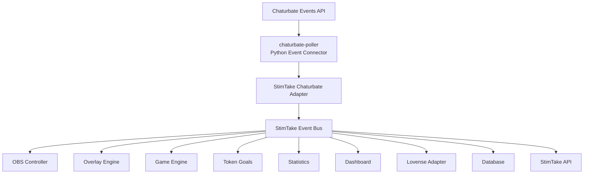
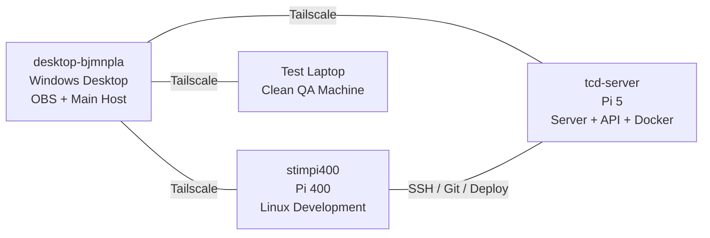
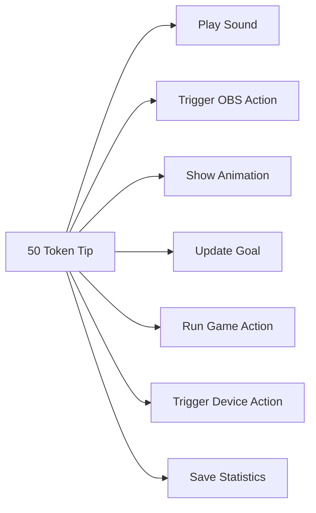
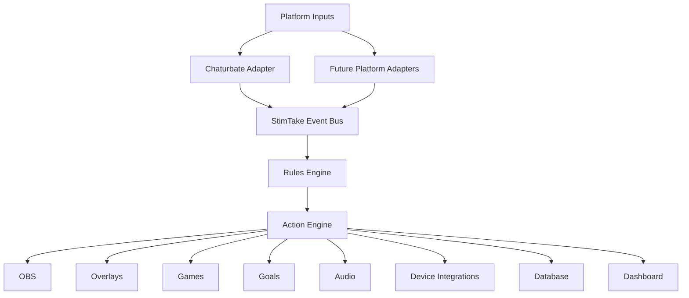
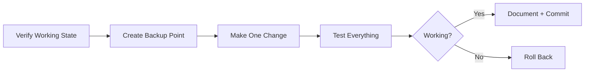

# StimTake Studio V1

> **Creator automation, event orchestration, OBS control, overlays, games, goals, analytics, and device integrations — built as one modular system.**

---

## Current Build Status

**Milestone:** Infrastructure Foundation  
**Overall Status:** 🟡 In Progress  
**Current Goal:** Keep all three machines connected through Tailscale and preserve a known-good working state.

```text
STIMTAKE STUDIO V1
█████░░░░░░░░░░░  Infrastructure Foundation
```

---

# Main Build Map



---

# Infrastructure Map



---

# Machine Roles

## Windows Desktop

**Role:** Main production and streaming machine

- OBS Studio
- Main StimTake control dashboard
- Overlay testing
- Local development tools
- Final production control

## Pi 400 — `stimpi400`

**Role:** Linux learning and development machine

- Linux command-line practice
- Python development
- Git workflows
- Adapter testing
- Safe service experiments
- Remote SSH access

**SSH command:**

```powershell
ssh tcdoverlord@100.99.239.36
```

## Pi 5 — `tcd-server`

**Role:** Main server

Planned services:

- StimTake API
- Docker services
- Database
- Event processing
- WebSocket service
- RTMP services
- Monitoring

## Test Laptop

**Role:** Clean user testing environment

- Install testing
- First-run testing
- Update testing
- User experience testing
- Proof-of-concept validation

---

# Project Folder Layout

```text
D:\StimTake-Studio
│
├── README.md
├── CHANGELOG.md
├── LICENSE
│
├── core
│   ├── event_bus
│   ├── rules
│   └── actions
│
├── adapters
│   ├── chaturbate
│   ├── obs
│   └── lovense
│
├── dashboard
├── overlay-engine
├── game-engine
├── api
├── database
├── docker
├── scripts
├── tests
├── docs
├── assets
├── builds
│
└── Third-Party
    └── chaturbate_poller
```

---

# Chaturbate Poller

A local reference copy is stored at:

```text
D:\StimTake-Studio\Third-Party\chaturbate_poller
```

Source repository:

```text
https://github.com/MountainGod2/chaturbate_poller
```

The poller is not StimTake Studio itself.

Its job is to receive Chaturbate Events API data such as:

- Tips
- Chat messages
- Room status changes
- User interactions

StimTake Studio will translate those platform-specific events into its own internal event format.

Example:

```json
{
  "source": "chaturbate",
  "event": "TIP_RECEIVED",
  "username": "example_user",
  "tokens": 50
}
```

That event can then trigger several actions:



---

# Core Design Rule

## The connector reports what happened.

```text
A user tipped 50 tokens.
```

## StimTake decides what that means.

```text
Play animation
Update token goal
Trigger OBS action
Run device response
Save statistics
Update leaderboard
```

This keeps StimTake modular and allows future platform adapters without rewriting the entire system.

---

# Planned Core Architecture



---

# Build Progress

| Component | Status |
|---|---|
| Main project folder | ✅ Complete |
| Third-party source folder | ✅ Complete |
| Chaturbate poller cloned | ✅ Complete |
| Windows desktop connected to Tailscale | ✅ Complete |
| Pi 5 connected to Tailscale | ✅ Complete |
| Pi 400 connected to Tailscale | 🟡 Verify after recovery |
| Remote SSH to Pi 400 | 🟡 Re-test |
| Hardware roles defined | ✅ Complete |
| Initial architecture defined | ✅ Complete |
| Git repository for main project | ⏳ Next |
| Safe backup point | ⏳ Next |
| Event bus | ⏳ Not started |
| Chaturbate adapter wrapper | ⏳ Not started |
| OBS controller | ⏳ Not started |
| Overlay engine integration | ⏳ Not started |
| Lovense adapter | ⏳ Not started |
| Dashboard | ⏳ Not started |
| Database | ⏳ Not started |
| Docker stack | ⏳ Not started |
| Installer | ⏳ Not started |

---

# Safe Change Rules

This project follows a production-style change process.



## Rules

1. **If it works, do not change it without a reason.**
2. **Identify the current installation before updating it.**
3. **Create a recovery point before infrastructure changes.**
4. **Make one change at a time.**
5. **Test before moving forward.**
6. **Document the exact working command.**
7. **Never store passwords, API tokens, or private keys in Git.**

---

# Security Rules

Do not commit:

```text
.env
API tokens
Passwords
Tailscale auth keys
SSH private keys
Database passwords
Lovense credentials
Personal user data
```

Recommended `.gitignore` entries:

```gitignore
.env
.env.*
!.env.example

*.key
*.pem
*.pfx
*.p12

secrets/
private/
logs/
__pycache__/
*.pyc

.venv/
venv/

node_modules/
dist/
build/
```

---

# Next Safe Milestone

## Milestone 2 — Known-Good Backup

Before building more features:

- Confirm all three Tailscale devices are online
- Confirm SSH access to `stimpi400`
- Record current versions without changing them
- Save network and recovery notes
- Create a backup point
- Initialize the main Git repository
- Commit this README as the first project checkpoint

Suggested first commit:

```text
docs: create StimTake Studio V1 engineering dashboard
```

---

# Vision

StimTake Studio is intended to become a modular creator automation platform that connects:

- Platform events
- OBS Studio
- Browser overlays
- Token goals
- Interactive games
- Audio
- Analytics
- Device integrations
- Remote services
- Creator dashboards

The long-term goal is one control system that turns incoming events into coordinated creator experiences.

---

## Project Status

```text
FOUNDATION:      IN PROGRESS
NETWORK:         MOSTLY READY
ARCHITECTURE:    DEFINED
CORE SOFTWARE:   NOT STARTED
FIRST PRIORITY:  STABILITY + BACKUP
```
