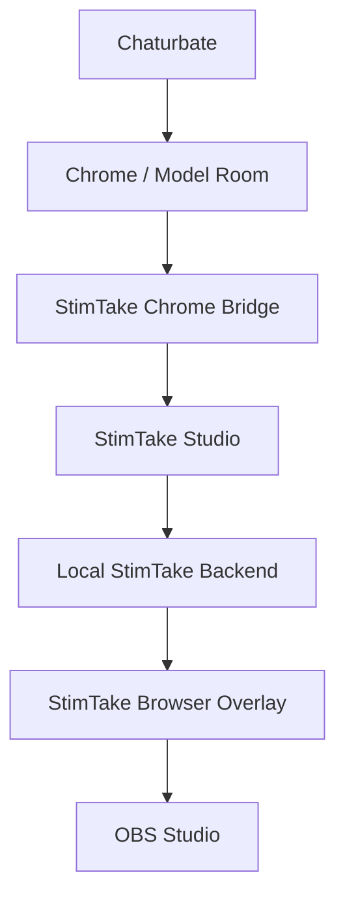
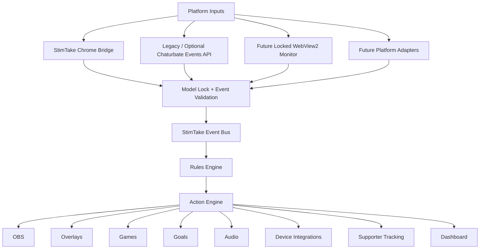
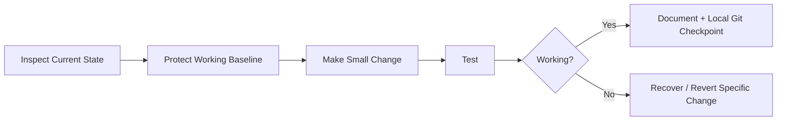

# StimTake Studio V1

> **Creator-controlled live-show automation for Chaturbate and OBS — with real tip reception, overlays, games, supporter tracking, actions, layouts, themes, and a modular connector architecture designed to stay local to the creator's Windows PC.**

---

## Current Build Status

**Milestone:** Chrome Bridge → StimTake Studio integration  
**Overall Status:** In Progress  
**Estimated V1 Progress:** ~80%  
**Current Goal:** Consolidate StimTake Studio into one creator-friendly application that owns the local backend, model connection, supporter state, overlays, and future embedded room monitor.

```text
STIMTAKE STUDIO V1

█████████████░░░  ~80%

CURRENT MILESTONE:
Chrome Bridge → Studio → OBS Reliability
```

The percentage is an engineering estimate, not measured test coverage. It should only advance when the corresponding capability is demonstrated.

---

# What StimTake Is Becoming

StimTake Studio is moving toward a simple creator workflow:

```text
Start StimTake Studio
        ↓
Saved Chaturbate model loads
        ↓
Local backend starts automatically
        ↓
Chrome Bridge / model monitor watches the configured room
        ↓
Real tip is received
        ↓
StimTake validates + deduplicates it
        ↓
Supporter totals / goals / games / actions update
        ↓
OBS overlays update
```

The finished product should not require the creator to understand localhost APIs, JSON payloads, connector internals, or separate backend launchers.

---

# Core Product Boundary

StimTake Studio V1 is designed to run on the creator's own Windows PC.

No Raspberry Pi, Tailscale network, remote server, Docker host, or second computer is required for the core product.



The intended creator setup remains local-first:

```text
Windows PC
├── StimTake Studio
├── Chrome / future embedded WebView2 room
├── StimTake Chrome Bridge
└── OBS Studio
```

---

# Current Proven Chrome Bridge Milestone

The StimTake Chrome Bridge has now been proven in a real Chaturbate room to:

- observe live DOM mutations;
- join the username row with the adjacent `tipped N token(s)` row;
- accept positive integer token amounts;
- support usernames containing letters, numbers, and underscores;
- reject room-goal text containing `tokens`;
- reject follow-up `Notice:` messages as duplicate tips;
- keep separate repeated tips from the same user as separate events;
- deliver one real visible tip exactly once;
- report the correct username and token amount.

The Bridge remains **receiver-only**.

It does not:

- send tips;
- buy tokens;
- perform payment actions;
- capture passwords;
- capture cookies;
- capture API tokens;
- depend on cloud services.

---

# Current Local Event Route

The Chrome Bridge currently reports normalized events to StimTake Studio through the local endpoint:

```text
http://127.0.0.1:8787/api/platform-event
```

Example event shape:

```json
{
  "type": "tip",
  "source": "chaturbate-browser",
  "room": "obsidian_stallion",
  "username": "viewer_name",
  "amount": 25,
  "message": "",
  "event_id": "unique-event-id",
  "timestamp": "..."
}
```

The intended acceptance rules are:

```text
source == chaturbate-browser
type == tip
room == locked model
username is valid
amount > 0
event_id is present
event_id has not already been consumed
```

The Chrome Bridge suppresses duplicate DOM delivery, and StimTake Studio is intended to provide a second idempotency boundary using `event_id`.

---

# Model-Friendly Connector Direction

The Connectors screen is being simplified around a creator-facing model connection instead of developer controls.

Target model workflow:

```text
MY CHATURBATE MODEL

Model address:
https://chaturbate.com/obsidian_stallion/

[SAVE MODEL]  [DELETE MODEL]

Model: obsidian_stallion • SAVED
Bridge: WAITING FOR TIP
Room: Waiting
Tips received: 0
Last tip: None
```

Once saved, the model address should be treated as locked.

To use a different model:

```text
Delete / Change Model
        ↓
explicit confirmation
        ↓
old model connection removed
        ↓
new model address entered
        ↓
save
```

The normal creator-facing screen should not expose:

- raw JSON;
- localhost endpoint details;
- adapter internals;
- API-token fields;
- development-only diagnostics.

Those belong under an optional Advanced / Diagnostics area.

---

# Planned WebView2 Room Architecture

WebView2 is a **planned feature**, not yet a completed or validated capability.

The intended design separates the locked model monitor from optional browsing:

```text
StimTake Studio
│
├── Locked Model Monitor
│     └── dedicated WebView2
│         always returns to / remains responsible for the saved model room
│
├── Optional Browser
│     └── separate WebView2
│         may browse elsewhere without changing StimTake's model lock
│
├── Local Backend
├── Supporter / Session State
├── Overlay Server
└── Optional Backstage Dashboard
```

The saved model remains the final safety boundary.

If the configured model is:

```text
obsidian_stallion
```

then:

```text
incoming room == obsidian_stallion
        → ACCEPT

incoming room != obsidian_stallion
        → REJECT
```

Browsing another model must never change the configured StimTake model automatically.

WebView2 must not be used by StimTake to capture:

- passwords;
- cookies;
- authentication tokens;
- session tokens;
- payment information.

---

# Planned Single-Application Runtime

The current Creator Cam / Backstage backend is useful, but the intended final experience is for StimTake Studio to own that backend automatically.

Target runtime:

```text
StimTake Studio.exe
        │
        ├── Studio UI
        ├── local backend
        ├── port 8787 event receiver
        ├── overlay server
        ├── supporter/session state
        ├── model lock
        ├── future WebView2 monitor
        └── optional Backstage window
```

Desired behavior:

```text
StimTake starts
→ backend starts

Open Backstage
→ dashboard window opens

Close Backstage
→ backend keeps running

Close StimTake
→ state is saved
→ backend shuts down cleanly
```

The creator should not need to launch a separate backend manually during normal operation.

---

# Backstage Dashboard

The Backstage Dashboard remains useful as an optional management and recovery interface.

It can contain:

- Top Tippers / Fans management;
- session history;
- backups;
- Action Deck controls;
- overlay settings;
- connector diagnostics;
- event logs;
- recovery tools.

The dashboard should not need to remain visible for normal tip tracking or overlay operation.

---

# Supporter Tracking Model

The intended supporter architecture is:

```text
real tip
    ↓
model-room validation
    ↓
event_id duplicate check
    ↓
username + amount accepted
    ↓
session total updated
    ↓
lifetime total updated
    ↓
Top Tippers / Fans recalculated
    ↓
state saved locally
    ↓
OBS refreshed
```

Two totals should remain distinct:

- **Session support** — current show/session activity.
- **Lifetime support** — persistent supporter history.

Backups should be used for recovery, not as the normal way to populate the leaderboard every show.

---

# Current Known Issue: Top Tippers / TestViewer State

The Top Tippers / Fans restore path is still under repair.

Observed behavior:

- the Windows Top Tippers / Fans list can restore the real saved supporter list;
- the OBS Top Tippers overlay can still display stale synthetic `TestViewer` state instead of the restored list.

This means the current overlay/supporter-state path is **not yet proven reliable**.

Do not describe Top Tippers restore as fixed until the real saved list replaces synthetic test state correctly in OBS.

Current direction:

```text
StimTake Studio = source of truth

OBS overlay = display only

Chrome Bridge = received-tip detector only

Backstage Dashboard = optional editor / manager
```

The goal is one authoritative supporter state owned by StimTake Studio.

---

# Core Design Rule

## The connector reports what happened.

```text
Viewer123 tipped 25 tokens.
Message: !dice
```

## StimTake decides what that means.

```text
Validate room
Reject duplicate event_id
Update Last Tipper
Update Top Tippers
Update Token Goal
Record Tip
Show Popup
Detect !dice
Run enabled action
Update OBS Overlay
Save supporter/session state
```

This keeps platform-specific detection separate from show logic.

---

# Planned Core Architecture



---

# Chaturbate Connector Strategy

StimTake currently preserves two connector directions.

## Route A — StimTake Chrome Bridge

```text
Chaturbate
     ↓
Broadcaster Chrome Session
     ↓
StimTake Chrome Bridge
     ↓
localhost
     ↓
StimTake Studio
```

**Status:** Real-room tip detection proven.

This is currently the strongest proven Chaturbate tip-input path.

## Route B — Chaturbate Events API

```text
Chaturbate
     ↓
Events API
     ↓
StimTake Events Connector
     ↓
StimTake Studio
```

**Status:** Existing / legacy integration work preserved.

The Events API work is not being silently deleted while the Browser Bridge path is stabilized.

---

# Browser Bridge Security Boundary

The StimTake Chrome Bridge has a deliberately narrow job.

## Allowed responsibilities

- detect supported received-tip activity in an authorized broadcaster room;
- obtain the viewer username;
- obtain the received token amount;
- obtain the tip message when available;
- identify the current room;
- create a normalized local event;
- send the event to StimTake Studio on the same computer.

## Outside the Bridge's responsibilities

- purchasing tokens;
- spending tokens;
- sending tips;
- automating purchases;
- accessing payment information;
- capturing passwords;
- capturing cookies;
- capturing private API credentials;
- cloud-based event routing.

The connector reports the event. StimTake owns show behavior.

---

# Current Build Progress

| Component | Status |
|---|---|
| StimTake Studio Windows UI | ✅ Working |
| Backstage Dashboard | ✅ Working |
| OBS browser overlay | ✅ Working |
| Action Deck | ✅ Working |
| Games | ✅ Present |
| Layout customization | 🟡 In progress |
| Theme / skin system | 🟡 In progress |
| Seasonal upgrade-pack architecture | 🟡 In progress |
| Local platform-event receiver | ✅ Present |
| Chrome Bridge live DOM observer | ✅ Proven |
| Chrome Bridge real username + amount detection | ✅ Proven |
| Chrome Bridge duplicate suppression | ✅ Proven in real-room milestone |
| Real Chaturbate tip → local Studio endpoint | 🟡 Integration path present; end-to-end Studio behavior still being hardened |
| Simplified model connector UI | 🟡 Candidate / integration work |
| Saved model room lock | ⏳ Planned next enforcement step |
| Top Tippers / Fan Board | 🔧 Active repair |
| TestViewer stale overlay state | 🔧 Active repair |
| Token goals | 🟡 Integration testing |
| Real tip → OBS complete path | ⏳ Must prove end-to-end |
| Automatic backend ownership by Studio | ⏳ Planned |
| Embedded WebView2 model room | ⏳ Planned |
| Separate browsing that cannot change model lock | ⏳ Planned |
| Installer / creator setup | ⏳ Remaining |
| Clean-machine QA | ⏳ Remaining |

---

# V1 Progress

```text
CORE STUDIO              ███████████████░  Strong
OBS / OVERLAYS           ██████████████░░  Strong / state repair active
ACTIONS / GAMES          ██████████████░░  Strong
CUSTOMIZATION            █████████████░░░  In Progress
TIP DETECTION            ███████████████░  Real Bridge Tip Proven
STUDIO TIP INTEGRATION   ████████████░░░░  In Progress
MODEL CONNECTION UX      ██████████░░░░░░  Simplification In Progress
SUPPORTER STATE          ██████████░░░░░░  Repair / Consolidation Needed
WEBVIEW2 MONITOR         ░░░░░░░░░░░░░░░░  Planned
INSTALLER / QA           ███████░░░░░░░░░  Remaining

ESTIMATED V1 TOTAL       █████████████░░░  ~80%
```

---

# Road to V1 Complete

## Current — Stabilize Studio Integration

Required:

- real Bridge event reaches StimTake Studio;
- configured model room is validated;
- duplicate event IDs are rejected;
- real username and amount update Studio correctly;
- stale synthetic test state cannot override real supporter state.

## Next — Consolidate Runtime

Required:

- StimTake starts the local backend automatically;
- only one backend owns the local port;
- Backstage becomes an optional window;
- supporter/session state has one authoritative owner;
- OBS becomes display-only.

## Next — Model-Friendly Experience

Required:

- save one Chaturbate model address;
- lock the model after save;
- explicit Change/Delete Model action;
- hide developer-facing connector details from normal use;
- clear WATCHING / WAITING / RECEIVING states.

## Next — WebView2 Model Monitor

Required:

- add WebView2 without unnecessary Studio rewrite;
- preserve current working connector path during transition;
- maintain a dedicated locked model room;
- optional separate browser must not alter the model lock;
- no credential/cookie/token capture;
- validate login/session behavior manually on Windows.

## Final — Release Validation

Required:

- one clean Windows installation;
- one clean Chrome / WebView2 environment;
- OBS test;
- restart persistence;
- recovery test;
- backup/restore test;
- real tip exactly once;
- real supporter list persistence;
- installer/package;
- final documentation;
- verified local Git checkpoint;
- release candidate archive and hashes.

---

# Definition of V1 Complete

StimTake V1 reaches 100% when a creator can reliably perform this workflow:

```text
Install StimTake
       ↓
Start StimTake Studio
       ↓
Saved model loads
       ↓
Backend starts automatically
       ↓
Model monitor / Bridge is watching
       ↓
OBS overlay is connected
       ↓
Go live
       ↓
Receive real tip
       ↓
StimTake detects it exactly once
       ↓
Correct model is verified
       ↓
Last Tipper updates
Top Tippers updates
Goal updates
Tip Log updates
       ↓
Requested game/action can trigger
       ↓
OBS shows the result
       ↓
Supporter/session state saves automatically
       ↓
Restart without losing required configuration
```

Until this complete path is demonstrated, V1 remains in development.

---

# Safe Change Rules

StimTake follows a protect-first development process.



Rules:

1. **Protect what works.**
2. **Inspect before changing.**
3. **Preserve unrelated files and uncommitted work.**
4. **Prefer the smallest responsible change.**
5. **Test before claiming success.**
6. **Use local Git checkpoints for stable milestones.**
7. **Never push unless explicitly approved.**
8. **Never store passwords, API tokens, private keys, cookies, or private signing material in Git.**
9. **Do not delete working legacy paths until the replacement has been proven.**
10. **Backups and recovery paths must remain available during architectural changes.**

---

# Security Rules

Do not commit:

```text
.env
API tokens
Passwords
Browser cookies
Browser session tokens
Authentication secrets
SSH private keys
Database passwords
Lovense credentials
Personal user data
Private signing keys
```

Recommended `.gitignore` entries:

```gitignore
.env
.env.*
!.env.example

*.key
*.pem
*.pfx
*.p12

secrets/
private/
logs/
__pycache__/
*.pyc

.venv/
venv/

node_modules/
dist/
build/
```

---

# Git and Recovery

Before significant changes:

```text
inspect repository root
inspect current branch
run git status
inspect recent history
confirm known-good tags
preserve unrelated changes
```

Do not use destructive reset/clean workflows against active work.

Current historical known-good tag referenced by the project workflow:

```text
StimTake-V1-75pct-Known-Good-2026-08-08
```

The tag should be verified in the actual local repository before relying on it as a recovery point.

---

# Project Direction

The intended final user experience is deliberately simple:

```text
1. Start StimTake Studio.

2. See:
   My Model          obsidian_stallion 🔒
   Model Monitor     WATCHING
   Backend           RUNNING
   OBS               CONNECTED

3. Go live.
```

Everything else should be available when needed, not required for ordinary operation.

---

# Vision

StimTake Studio is intended to become a modular creator automation platform connecting:

- Chaturbate tip events;
- OBS Studio;
- browser overlays;
- supporter tracking;
- token goals;
- interactive games;
- Action Decks;
- layouts;
- themes and upgrade packs;
- audio;
- analytics;
- device integrations;
- local creator dashboards;
- future platform connectors.

The long-term goal is one creator-controlled system that turns incoming events into coordinated show experiences while allowing connectors, overlays, games, and future integrations to evolve independently.

---

## Project Status

```text
ESTIMATED V1:       ~80%
CORE STUDIO:        STRONG
OBS / OVERLAYS:     STRONG / SUPPORTER STATE REPAIR ACTIVE
ACTIONS / GAMES:    STRONG
CHROME BRIDGE:      REAL TIP DETECTION PROVEN
STUDIO INTEGRATION: IN PROGRESS
MODEL LOCK:         PLANNED / NEXT
WEBVIEW2:           PLANNED
INSTALLER / QA:     REMAINING

CURRENT PRIORITY:
ONE AUTHORITATIVE STUDIO BACKEND + RELIABLE SUPPORTER STATE
```

---

**Protect what works. Preserve the truth. Build in modules. Carry the knowledge forward.**
